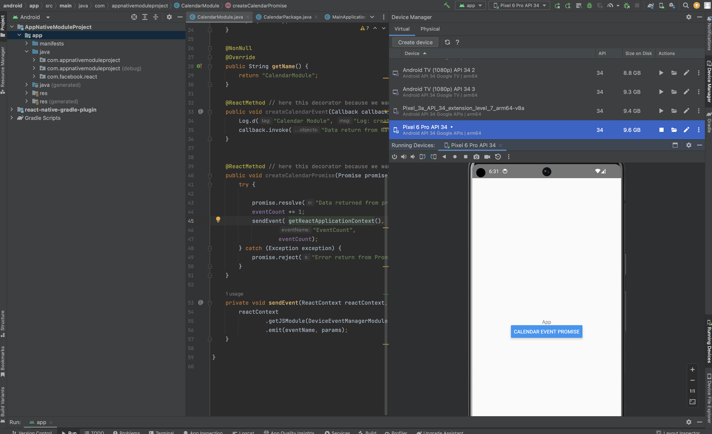

# Native Modules Intro Example Native Bridging for iOS and Android in React Native

This is the demo in react native which is achieved using Native Bridging in iOS and Android

## Step 1: Android Native Modules

## Step 2: iOS Native Modules

# Imporant :

i put all tow step(android and ios) together in this example
comment the android stpe when you are running the ios module vice versa

💻 Screen Shoot💻




## To Start your Application

Let Metro Bundler run in its _own_ terminal. Open a _new_ terminal from the _root_ of your React Native project. Run the following command to start your _Android_ or _iOS_ app:

### For Android

```bash
# using npm
npm run android

# OR using Yarn
yarn android
```

### For iOS

```bash
# using npm
npm run ios

# OR using Yarn
yarn ios
```
